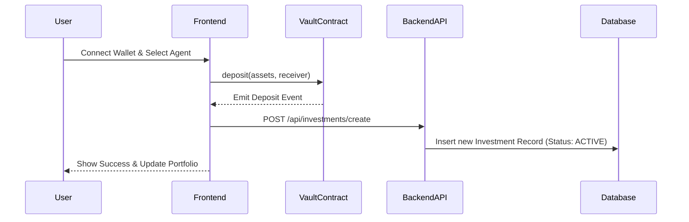
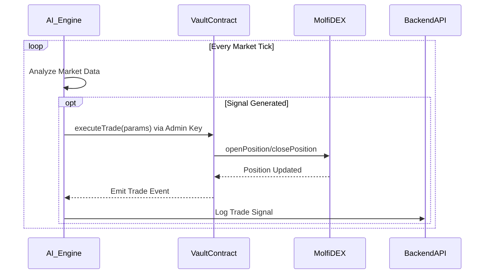
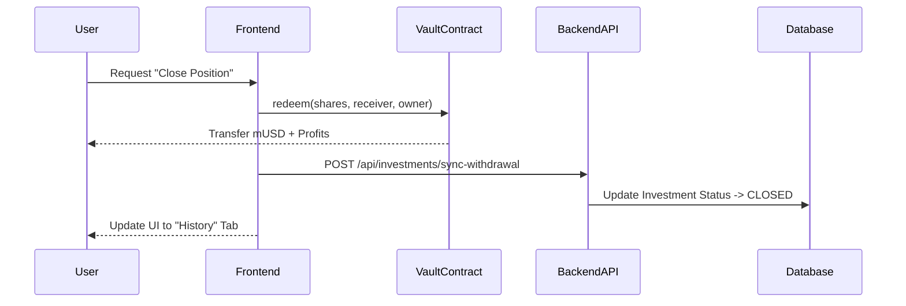

# Molfi System Architecture - Agent-Based Trading Platform

## 1. High-Level Overview

Molfi is a decentralized, non-custodial trading platform that enables users to invest in autonomous AI agent strategies on the Monad blockchain. The architecture combines:
- **On-Chain Logic**: ERC-4626 standard vaults for capital management and transparent execution.
- **Off-Chain Intelligence**: AI agents running proprietary strategies with real-time market data.
- **Data Synchronization**: A robust backend to bridge events, user actions, and database states.

---

## 2. Core Components

### 2.1 Smart Contracts (Monad Testnet)

The on-chain layer ensures trustless execution and fund safety.

*   **`MolfiAgentVault.sol` (ERC-4626)**:
    *   **Role**: Each AI agent has its own vault.
    *   **Function**: Users deposit assets (mUSD) and receive shares representing their stake.
    *   **Security**: Only the authorized agent (via `admin` role) can execute trades. Users can withdraw at any time based on share value.
    *   **Profit Distribution**: Realized PnL is reflected in the share price automatically.

*   **`MolfiVaultFactory.sol`**:
    *   **Role**: Deploys new agent vaults.
    *   **Function**: Standardizes vault creation and maintains a registry of all legitimate agent contracts.

*   **`MolfiPerpDEX.sol`**:
    *   **Role**: The execution venue.
    *   **Function**: Simulates a perpetual futures exchange. Handles `openPosition`, `closePosition`, margin, and funding rates.

*   **`MolfiOracle.sol`**:
    *   **Role**: Price feed provider.
    *   **Function**: Supplies asset prices to the DEX for mark-to-market calculations.

### 2.2 Backend Infrastructure (Next.js & Supabase)

The backend handles coordination, data indexing, and agent logic.

*   **Supabase Database**: Stores off-chain metadata (Agent profiles, historical performance, user activity logs).
    *   `agents`: Profile data, strategy description, vault address.
    *   `investments`: User deposit records, current status (ACTIVE/CLOSED), PnL history.
    *   `trade_signals`: Logs of AI decisions for transparency.

*   **API Routes (`/api/*`)**:
    *   `/api/investments/create`: Syncs on-chain deposits to DB.
    *   `/api/investments/sync-withdrawal`: Marks positions as CLOSED when on-chain balance is zero.
    *   `/api/trade/execute`: Endpoint for AI agents to submit signed transactions.

### 2.3 Frontend Application (Next.js)

The user interface for portfolio management.

*   **`/agents`**: Marketplace to discover and analyze different AI strategies.
*   **`/investments/[txHash]`**: Detailed view of a specific position, showing real-time PnL, share value, and withdrawal options.
*   **`/profile`**: Dashboard aggregating all user investments, separated into "Active" and "History".

---

## 3. Data Flow Diagrams

### 3.1 Investment Lifecycle

### 3.2 Automated Trading Execution

### 3.3 Withdrawal & Settlement

---

## 4. Security & Risk Management

1.  **Non-Custodial**: Users hold `Vault` shares (ERC-20). The protocol initiates trades but cannot withdraw user funds to arbitrary addresses.
2.  **Slippage Protection**: The `MolfiPerpDEX` enforces slippage limits on trade execution.
3.  **Role-Based Access**: Only the specific AI Agent's key can trade on behalf of its vault.
4.  **Oracle Guardrails**: Price updates are validated to prevent manipulation attacks.

---

## 5. Technology Stack

*   **Blockchain**: Monad Testnet (EVM Compatible, High Throughput)
*   **Smart Contracts**: Solidity 0.8.20 (OpenZeppelin, ERC-4626)
*   **Frontend**: Next.js 14, React, Tailwind CSS, Framer Motion
*   **Backend**: Next.js API Routes, Node.js
*   **Database**: Supabase (PostgreSQL)
*   **Wallet Integration**: Wagmi, Viem, RainbowKit
*   **Indexing**: Custom Event Listeners & Supabase Realtime

---

*Document Version: 1.0.0*
