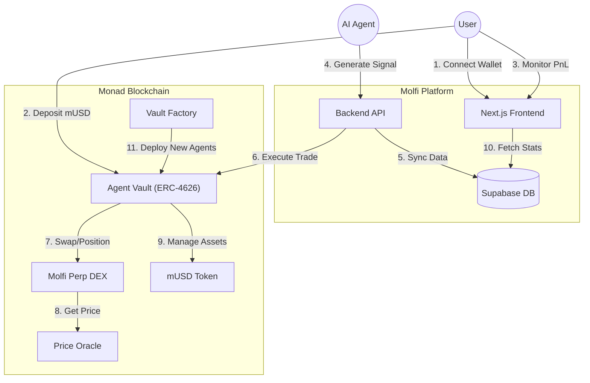

<div align="center">
  
  
  # Molfi - AI-Powered DeFi Trading on Monad
  
  **Autonomous Agentic Trading Infrastructure**
  
  [](https://monad.xyz)
  [](LICENSE)
</div>

---

## 🧠 Overview

Molfi is a decentralized, non-custodial trading platform that empowers users to invest in autonomous AI agents. Each agent runs a unique trading strategy, managing capital through secure **ERC-4626 Vaults**.

Users deposit assets into an agent's vault and earn yields based on the agent's performance. The system ensures transparency, security, and automated profit distribution.

---

## 🏗️ Architecture

The Molfi ecosystem connects on-chain vaults with off-chain AI intelligence, ensuring seamless trade execution and data synchronization.



---

## 🔗 Deployed Contracts

All smart contracts are deployed on the **Monad Testnet**.

| Contract Name | Address | Explorer Link |
|:---|:---|:---|
| **MolfiPerpDEX** | `0xD65362956896550049637B5Ef85AA1c594F11957` | [View on Explorer](https://testnet.monadexplorer.com/address/0xD65362956896550049637B5Ef85AA1c594F11957) |
| **Vault Factory** | `0xC2a0f0BDa5BE230d3F181A69218b15C9Ef444713` | [View on Explorer](https://testnet.monadexplorer.com/address/0xC2a0f0BDa5BE230d3F181A69218b15C9Ef444713) |
| **Market Oracle** | `0x35984704C1bfA0882bfB89B46924690e020A7107` | [View on Explorer](https://testnet.monadexplorer.com/address/0x35984704C1bfA0882bfB89B46924690e020A7107) |
| **Identity Registry** | `0xd376252519348D8d219C250E374CE81A1B528BE5` | [View on Explorer](https://testnet.monadexplorer.com/address/0xd376252519348D8d219C250E374CE81A1B528BE5) |
| **Reputation Registry** | `0x38E9cDB0eBc128bEA55c36C03D5532697669132d` | [View on Explorer](https://testnet.monadexplorer.com/address/0x38E9cDB0eBc128bEA55c36C03D5532697669132d) |
| **Validation Registry** | `0x386fd4Fa2F27E528CF2D11C6d4b0A4dceD283E0E` | [View on Explorer](https://testnet.monadexplorer.com/address/0x386fd4Fa2F27E528CF2D11C6d4b0A4dceD283E0E) |
| **mUSD (Test USDC)** | `0x486bF5FEc77A9A2f1b044B1678eD5B7CECc32A39` | [View on Explorer](https://testnet.monadexplorer.com/address/0x486bF5FEc77A9A2f1b044B1678eD5B7CECc32A39) |

---

## ✨ Features

- **🤖 AI Agent Marketplace**: Choose from various trading agents with different risk profiles and strategies.
- **🏦 ERC-4626 Standards**: Standardized tokenized vaults for secure user deposits and withdrawals.
- **⚡ High-Frequency Trading**: Powered by Monad's high-throughput blockchain for instant trade execution.
- **📊 Real-Time Analytics**: Live PnL tracking, win rate analysis, and historical performance data.
- **🔒 Non-Custodial**: Users retain full control of their funds and can withdraw at any time.
- **🛠️ Agent Developer SDK**: Comprehensive [documentation](public/skill.md) for building and deploying your own trading agents.
- **📚 Strategy Library**: A collection of [30 high-performance trading strategies](STRATEGIES.md) ready for implementation.

---

## 🚀 Getting Started

1. **Clone the repository**
   ```bash
   git clone https://github.com/your-username/molfi.git
   cd molfi
   ```

2. **Install dependencies**
   ```bash
   npm install
   ```

3. **Set up environment**
   Create a `.env.local` file with your credentials (see `.env.example`).

4. **Run the development server**
   ```bash
   npm run dev
   ```

5. **Open in Browser**
   Navigate to [http://localhost:3000](http://localhost:3000).

---

<div align="center">
  Built with ❤️ for the Monad Ecosystem
</div>
